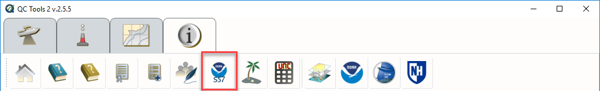
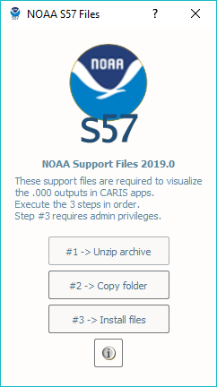
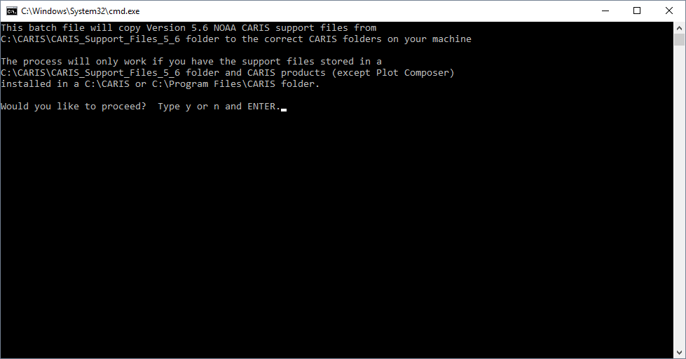

Info Tab
========

The Info Tab contains numerous helpful links and utilities:

	* The homepage
	* The Online User Manual
	* The Offline User Manual (PDF)
	* License Information
	* Authors List
	* NOAA S-57 Support Files for CARIS
	* The HydrOffice Main Page
	* The Center for Coastal and Ocean Mapping Main Page
	* The University of New Hampshire Main Page

|

-----------------------------------------------------------

|

NOAA S-57 Support Files for CARIS
^^^^^^^^^^^^^^^^^^^^^^^^^^^^^^^^^

These allow for use of customized S-57 attributes in CARIS software and are required in order to visualize
many of the S-57 (.000) outputs.

To install them, follow these instructions:

* Click the button on the Info Tab for the **NOAA S57 Support Files** (see :numref:`fig_info_tab_s57`).

.. _fig_info_tab_s57:

    The **Info** tab with the **NOAA S57 Support Files** button.

* Click the button to unzip the archive (see :numref:`fig_support_unzip`).

* Click the button to copy the folder (see :numref:`fig_support_unzip`). If the folder is already found, you will be prompted whether or not you wish to force a re-copy.

* Click the button to install the files (see :numref:`fig_support_unzip`). Note this step requires Administrator privileges.

.. _fig_support_unzip:

    The **NOAA S57 Support Files** widget.

* Follow the prompts in the Windows shell to complete the installation (see :numref:`fig_support_cmd`).

.. _fig_support_cmd:

    The Windows shell triggered by the **NOAA S57 Support Files** widget.
